# 1. Elementos UI y UX de laboratoria.la

## Análisis UI  
Dentro de los elementos gráficos empleados a lo largo de la página web de Laboratoria laboratoria.la, encontramos:
- El uso de las Tipografías Montserrat peso 400 y 700, Museo Sans.
- Botones rectangulares con color amarillo opaco valor hexadecimal #f7b617 con texto en versalitas. De lado Izquierdo fondo del color antes mencionado con letra obscura "Estudiantes"; lado derecho "Empresas" contorno y texto amarillo opaco igualmente.

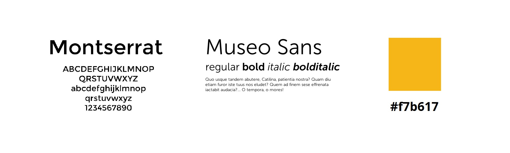

- Menú de navegación principal, estático.
- Menú lateral para compartir página web en redes sociales (facebook, twitter, correo electrónico) con posicionamiento fijo al dar scroll sobre línea "y" (vertical).
- Títulos y énfasis en mayúsculas, con Museo sans, pesos 400 y 700.
-Home page: Background image de alumnas egresadas en ceremonia de graduación. Con texto centrado en color blanco, título resaltado con peso bold y tamaño aproximado de 36 px (ordenador); Debajo ícono lineal tipo flecha sencilla indicando mayor información hacia abajo.

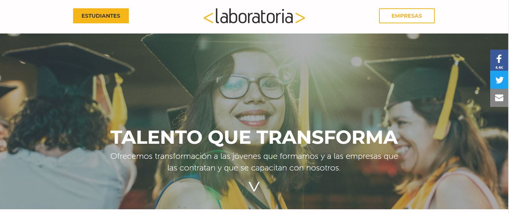

A continuación una serie intercalada de información más detallada por secciones y frases acerca de Laboratoria. (en 8 secciones principales).
- Secciones de información (4). Secciones 1,3,5: Fondo gris aclarado color hexadecimal #F7F7F7, texto centrado. Título en color negro, tamaño aproximado de 22px; subtítulo en amarillo opaco en jerarquía de tamaño levemente inferior, en la parte superior de la sección. Pleca (icono de línea divisoria entre la información) debajo de títulos, en combinación con subtítulos.
- Contenido informativo en Museo sans regular. Botones resaltados tipo 1 que direccionan a Views de la web, externas al index.html. Para postular como alumna o adquirir un servicio como empresa.

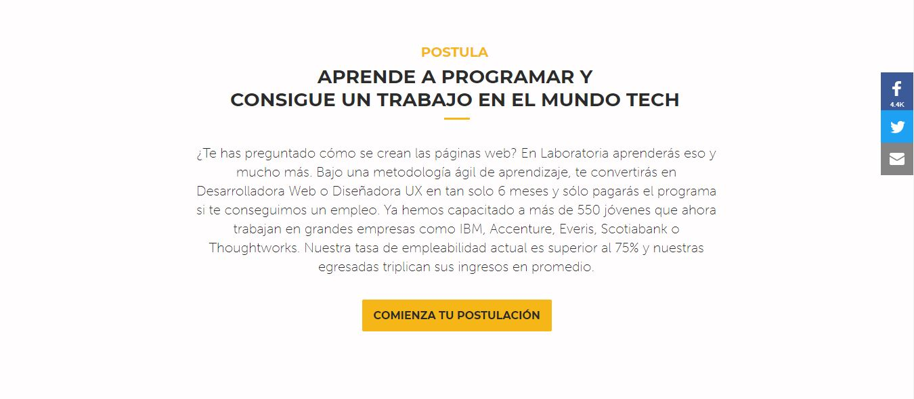

- Secciones de frases "célebres" sobre Laboratoria (4). Secciones 2,4,6: Background image de persona que mencionó la frase, al ancho de la página y con altura aproximada (vistas desde ordenador) de 395px, con un filtro fijo de opacidad media que permite la lectura del texto; Orden de texto: Frase mencionada, nombre de la persona como título y debajo información sobre el puesto que tiene y la empresa donde trabaja.  

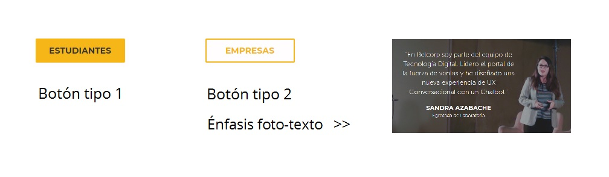

- Sección enfática de información. Sección 7 (siguiendo la secuencia): Se presentan datos duros sobre el impacto de la empresa en cajas rectángulares de 200 x 165 pixeles (vista desde ordenador) resaltadas de fondo color Laboratoria, números centrados con alineación vertical a la mitad en Museo sans 700, tan anchos como caja de texto contenedora.
- Sección de frase enfática. Sección 8: Mismas características de background image. La frase se muestra mayormente resaltada, en mayúsculas con mayor porcentaje de tamaño de fuente. Al ser un personaje reconocido no se indica puesto ni empresa.

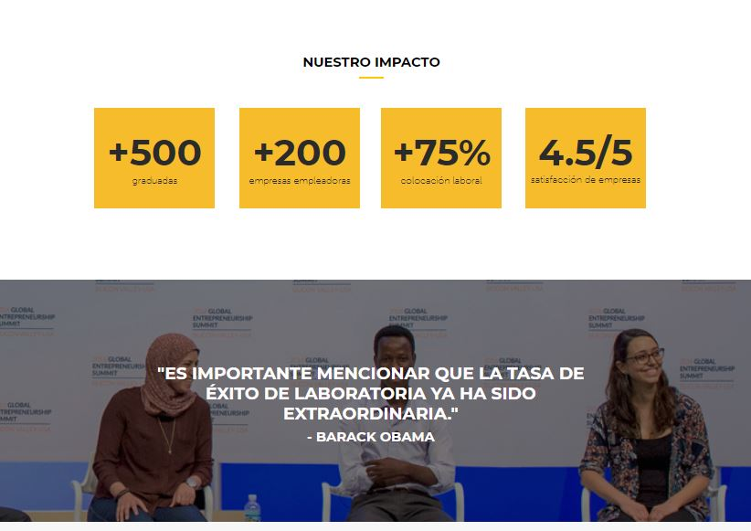

- Secciones 9 y 10. Aliados regionales y reconocimientos, respectivamente: Se muestran logotipos de las empresas a 3 columnas, divididas por una diferencia de color de fondo entre blanco y gris aclarado.

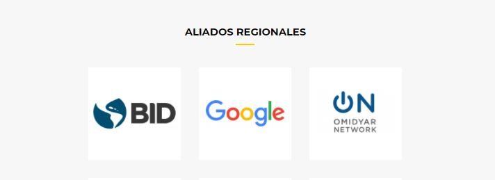

- Secciones 11 y 12. Presencia en medios y blog, respectivamente: Además del logo o una imágen que ilustra el contenido, se aumenta un texto informativo que añade breve introducción. En el caso del blog, son las primeras líneas de la entrada y en la parte inferior de las columnas un link para poder seguir el blog.

- Footer: Logo y texto en "negativo", sobre fondo gris obscurecido valor hexadecimal #2B2B2B. Debajo del logo, breve descripción sobre labor de la organización. Del lado derecho 3 líneas con hipervínculo: Contáctanos, Trabaja con nosotros, Blog.

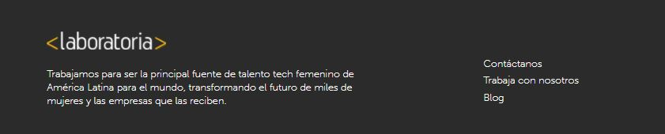

## Análisis UX

**Motivo principal de negocio:** Reclutar alumnas al programa (obtener nuevos clientes).

**Motivos secundarios de negocio:** *1.* Captar el interés de empresas externas para para comercializar la adquisición de trabajadoras capacitadas por Laboratoria. *2.* Vender capacitaciones a empresas.

**Enfoques sociales:** *1.* Brindar oportunidades laborales a mujeres con talento  que no han tenido buenas oportunidades educativas o laborales. *2.* Cerrar la brecha de género en el sector tecnológico. (Lo anterior describe un nivel de conexión emocional significativa de tipo altruista al tratar problemáticas sociales de las mujeres actualmente, sector vulnerable y principal cliente).

### ¿Cómo debe ser la experiencia al navegar?
*Postular debe ser una tarea sencilla de realizar.* Por medio de imágenes las mujeres interesadas deben poderse identificar y proyectar. Debe brindarse seguridad por medio de un respaldo de empresas líder y de personas (tangibles) cuya experiencia u opinión brinde seguridad.

### Análisis de elementos

- *La imagen Hero mostrada en la home page* es lo primero que capta la atención dentro de la experiencia **(See)**. Es lo suficientemente pregnante para transmitir los objetivos de superación y plenitud que el programa puede brindar a mujeres jóvenes latinoamericanas. Acompañada por un texto que complementa la experiencia  resumiendo muy brevemente los objetivos **(Think)**. Haciendo la invitación a conocer más por medio de un ícono lineal tipo flecha **(Do)**.

- *Los botones* cumplen la función de facilitar el proceso de postulación **(Do)**, ya que poder realizar una tarea por medio de oprimir un botón es una forma sencilla de lograr un objetivo.
Durante la navegación están presentes **(See)** unos recuadros con iconos de redes sociales (facebook, twitter, correo electrónico), los cuales al ser presionados **(Do)** te direccionan a tus propios perfiles en redes para compartir la página web de Laboratoria. La experiencia de usuario, podría mejorar al direccionar hacia las redes de Laboratoria, para mayor información o contacto *para resolver dudas*, o bien  si se especificara que dichos hipervínculos mostrados son para compartir (share contents).

- Dentro de las secciones de *información y frases*; el primer par tiene el objetivo de *otorgar información precisa sobre el procedimiento y los alcances que tiene el programa* **(Think)** y por medio de la imagen **(See)** acompañada de una frase, dar *testimonio vivencial* de una de las egresadas; este par de secciones tiene por objetivo *transmitir mayor confianza* y va dirigido a las interesadas en postularse **(Do, inicia un sentido de lealtad –Care-)** acompañado nuevamente de un botón que da un vínculo directo al llenado de formulario de manera sencilla *(Do)*. La plataforma te acompaña todo el tiempo para que en el momento que tomes la decisión sea muy fácil para ti encontrar cómo postular.

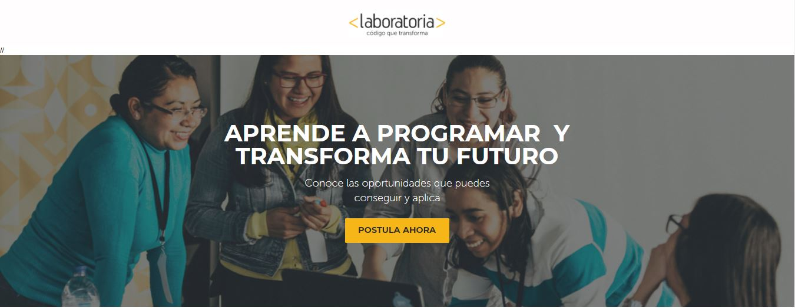

- El segundo par  de información y frase, está *dirigido a las empresas* y tiene por objetivo *mostrar* que el proceso de capacitación de Laboratoria es *extensivo y confiable*, describiendo los criterios de selección, evaluación y metodología **(Think, care)**. A continuación se presenta el caso real de una frase mencionada por el Ejecutivo en Jefe de una empresa de renombre, sobre su adquisición de talento tecnológico en Laboratoria, creando dentro de la experiencia el interés suficiente *(See, Awareness)* para conocer más y presionar el botón “Conoce nuestro talento” **(Do)**, sección que mostrará datos con el poder de generar lealtad y convencimiento de estar *frente a la mejor opción* **(Diferenciation, Care)**.

- En la tercera sección de estas combinaciones de *información e impacto* se busca brindar *evidencias concretas e inamovibles* que consoliden la visualización de la **“Comunidad Laboratoria”** ante el usuario, para ello se exponen *datos duros*  que demuestran el desempeño de Laboratoria a lo largo de su trayectoria y la *presencia internacional* que tiene como organización, al ser reconocida por Barack Obama y Mark Zukerberg, personas de éxito y *top influencers en innovación e industria tecnológica*.**(Loyalty, Care)** Posteriormente, se muestra el respaldo de empresas que ya forman parte de la comunidad, de la cual se hace la invitación a formar parte *(Loyalty, Care, Community)*. Y por último se exponen *entradas del blog*, sección dirigida a las postulantes, donde puedes leer y percibir directamente palabras  y experiencias de los fundadores (nos permite confiar en las personas detrás, quienes han creado Laboratoria)y de otras mujeres igual que tú, esta sección demuestra que *está a tu alcance formar parte* y vivir el cambio de vida **(Loyalty, Care)**.

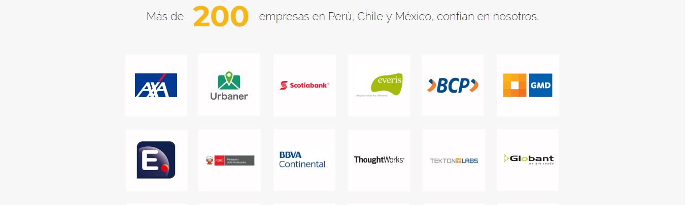

- Dentro del footer y como parte (quizás final) de la experiencia por parte del usuario, puede encontrar un resúmen que engloba y cierra toda la información: **qué y para quién Laboratoria hace lo que hace.** Seguido de ello, brinda los datos de contacto de los Directores *(Confianza, Seguridad)*.

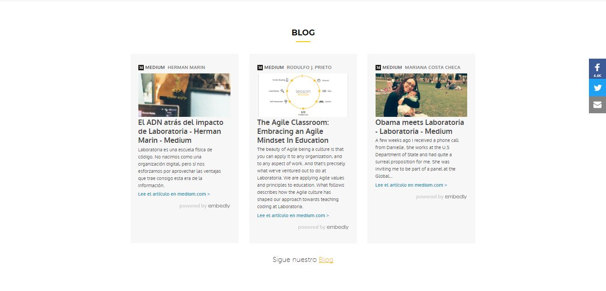

La postulante o empresa no sólo son invitados a postular o inscribirse al programa, son invitados abiertamente a **formar parte activa de un movimiento social** que impulsa mujeres, que capacita y emplea el mejor talento y que empodera a Latinoamérica a nivel mundial: **User Experience.**

***

# 2. Análisis de Navegación en GitHub

## Descripción de plataforma
GitHub es una plataforma de desarrollo colaborativo que tiene un sistema de control de versiones (Git). Actualmente es utilizado por la mayoría de las empresas de tecnología en su flujo de trabajo. También ofrece GitHub pages, función que permite alojar páginas personales, de organización o de proyecto directamente desde un repositorio de GitHub.

## Desglose de elementos
De forma general, Github utiliza  **“Navegación coherente”** al mantener el identificador y un menú con secciones de manera fija en la parte superior del sitio independientemente de la vista o sección que se esté navegando, ya que da un sentido de orientación y estabilidad al usuario *(Conforme al texto “Diseño de la navegación”, página 82)*:

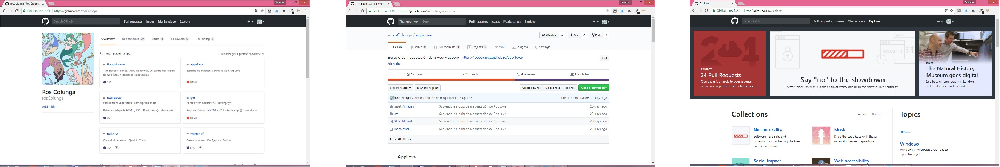

En primer lugar, al no estar *"logeado"*, la página presenta un menú de **Navegación global** que contiene de lado izquierdo la identificación del sitio por medio de la silueta de su personaje *Octocat*, que es su logotipo y es el elemento que al dar click siempre te llevará a Home; seguido de 5 secciones de *navegación principal*;  un recuadro de búsqueda y por último 2 utilidades para poder ingresar a la página por primera vez *(Sign up)* o con datos de usuario existentes *(Sign in)*.

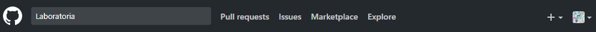

Una vez que se ha ingresado, nos encontramos con un menú de **Navegacion local** ya que presenta las secciones que  ayudarían al usuario a navegar en una vista en particular, en este caso desde su propio perfil.

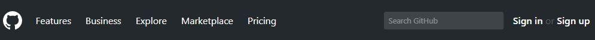

Al realizar alguna búsqueda, se nos presenta además de los resultados obtenidos, una barra de **Navegacion facetada** es decir que han filtrado la información en secciones establecidas. Puedo seleccionar repositorios, código, entre otras opciones.

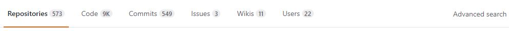

E incluso presenta la opción de navegar entre los resultados de forma *filtrada*, al dar la opción al usuario de seleccionar los criterios específicos que le interesa obtener, por ejemplo el repositorio con más estrellas, en un lenguaje de programación C++. Aquí vemos la **Navegación filtrada**.

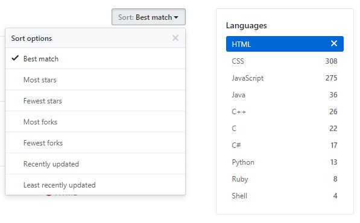

Otro tipo de navegación presente en GitHub, es muy claro al seleccionar “Explore”. Ya que te muestra una serie de colecciones enfocadas en tus intereses o búsquedas recientes. Este es el tipo de **Navegación Contextual**.

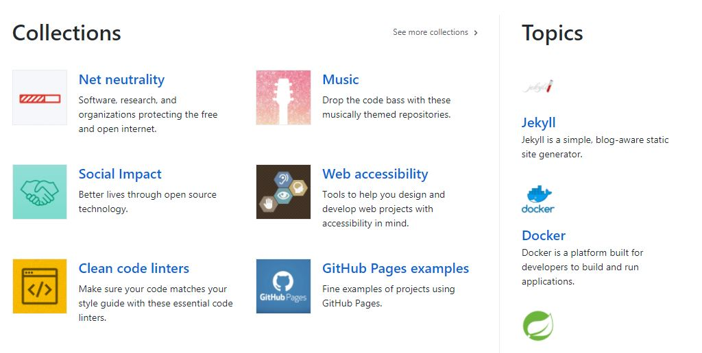

También podemos encontrar el tipo de **Navegación en línea**, al realizar una búsqueda que no se pudo encontrar: Nos mostrará un texto dentro del cual viene un link *(“a new search query”/ advanced search)* de referencia con una opción o información adicional que el usuario elige si consulta o no.

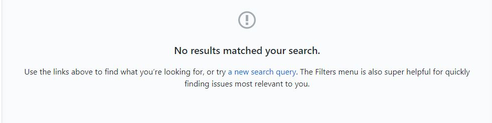

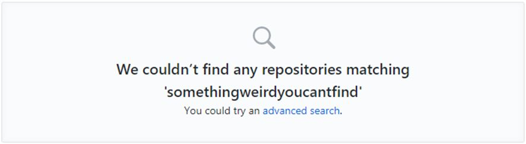

***

# 3. Sketch para herramienta *dashboard* de Laboratoria

## Descripción de concepto
El dashboard de Laboratoria es una herramienta que permite a los usuarios (training managers, teachers, entre otros miembros) ver rápidamente *estadísticas y datos* en tiempo real para estar al tanto del desempeño y progreso o dónde prestar atención especial.

- Para este ejercicio se debe tomar en cuenta, las *4 sedes*; datos de *número de alumnas totales inscritas y que desertaron* durante el bootcamp, cuántas (porcentaje) cumplen con el *nivel mínimo de evaluación*; el *promedio de notas por sprint, HSE, y de nivel técnico*. Así como la posibilidad de visualizar datos *por generación*.

## Discurso de propuesta generada
La propuesta para Dashboard, incluye la misma identidad gráfica que utiliza la organización. Tiene una barra de **navegación global** en la parte superior, con identificador del logotipo de Laboratoria al centro, el título de la página del lado izquierdo y del lado derecho, la utilidad de cerrar sesión por medio de un menú hamburguesa.

Contiene una barra de **navegación facetada** del lado izquierdo, por medio de un menú vertical con 3 secciones y la visualización de los datos de la persona usuaria de la cuenta; la primera sección *“Alumnas”* permite observar de forma general (vista rápida) el número de alumnas de las generaciones por sede, inscritas (que iniciaron el curso) y actuales (cantidad total de alumnas, menos alumnas que han desertado). Esta información está al día, con las generaciones en curso; la segunda sección *“Settings”*, permite al usuario cambiar dentro de su configuración, la contraseña y el Nick Name. (Elementos que permiten un sentido de apropiación / vínculo emocional dentro del sitio); la tercera sección indica otra forma de salir del sitio *"Cerrar sesión"*.

Dentro del contenido de la página, encontramos *4 secciones* divididas en formato de **Tabs**, las 4 sedes de Laboratoria. En cada una se mostrará de forma predeterminada la información de *datos y gráficas de la generación actual*. Teniendo en la parte superior un *menú desplegable* con la posibilidad de seleccionar la generación que se desea visualizar.

De forma específica dentro de la información presentada, en primer lugar se muestran los detalles de las *alumnas inscritas y actuales*, por medio de una gráfica dividida en dos partes, con el número de alumnas al finalizar el bootcamp. En caso de la generación actual, se mostraría la actualización hasta el último mes completado.

Las siguientes secciones conforman la vista por medio de gráficas de:   Promedio de notas HSE; Promedio de notas técnicas.Porcentaje de alumnas que pasan el criterio mínimo de evaluación; Promedio de notas (ambos criterios) por sprint;

### Boceto a mano
Como una primera aproximación al problema, se planteó como punto de partida la visualización inicial de la página. Señalando las funcionalidades básicas y secuencias de interacción, al seleccionar las secciones.

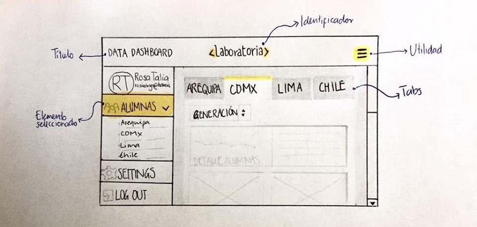

### Sketch en Figma
Se desarrolla el esqueleto a línea dentro del formato “Desktop HD” que permite organizar la propuesta en medidas reales, distribuir los espacios y descubrir posibilidades que no habían sido contempladas dentro del bocetaje a mano como las múltiples posibilidades al interactuar.

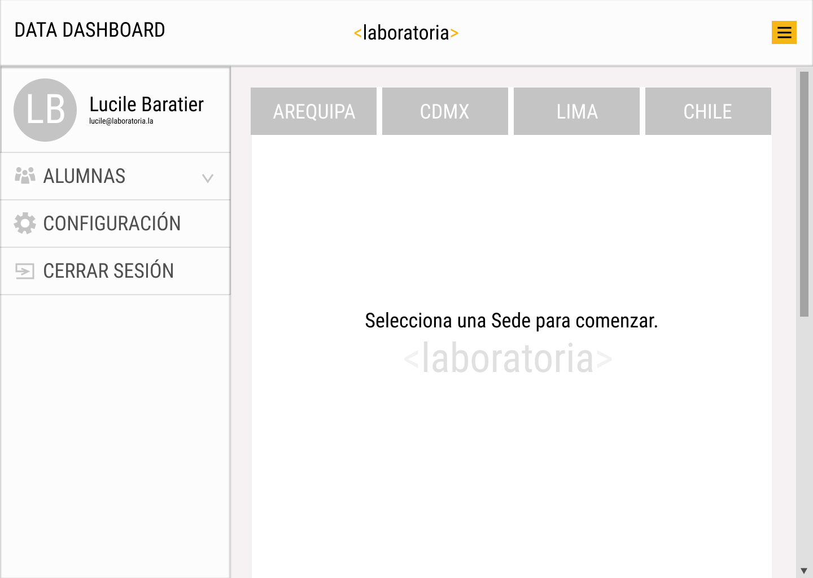

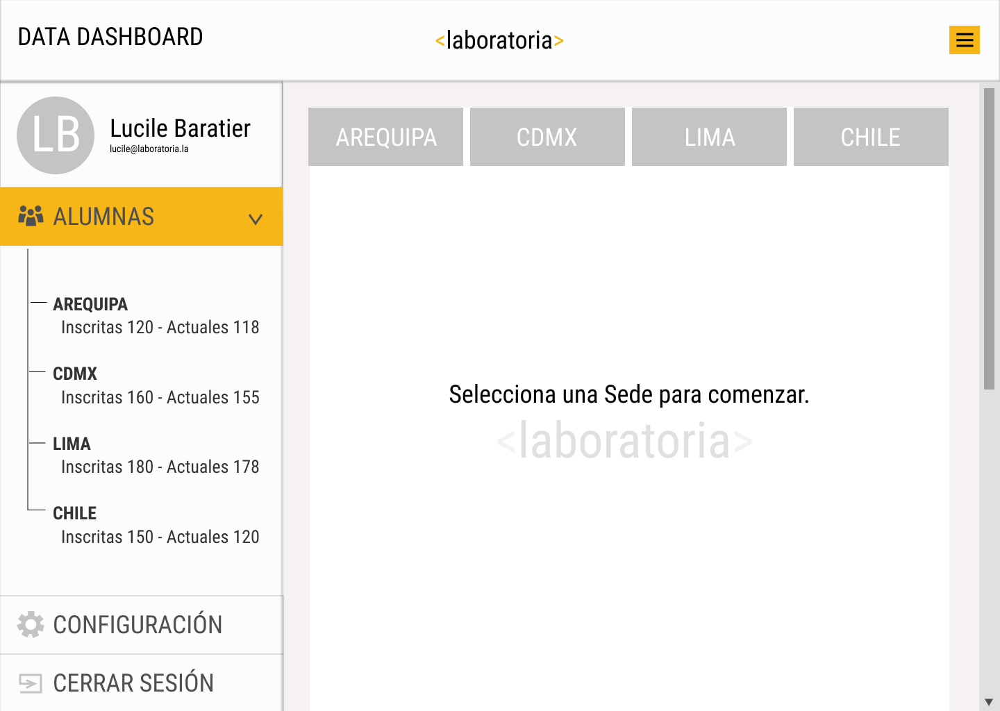

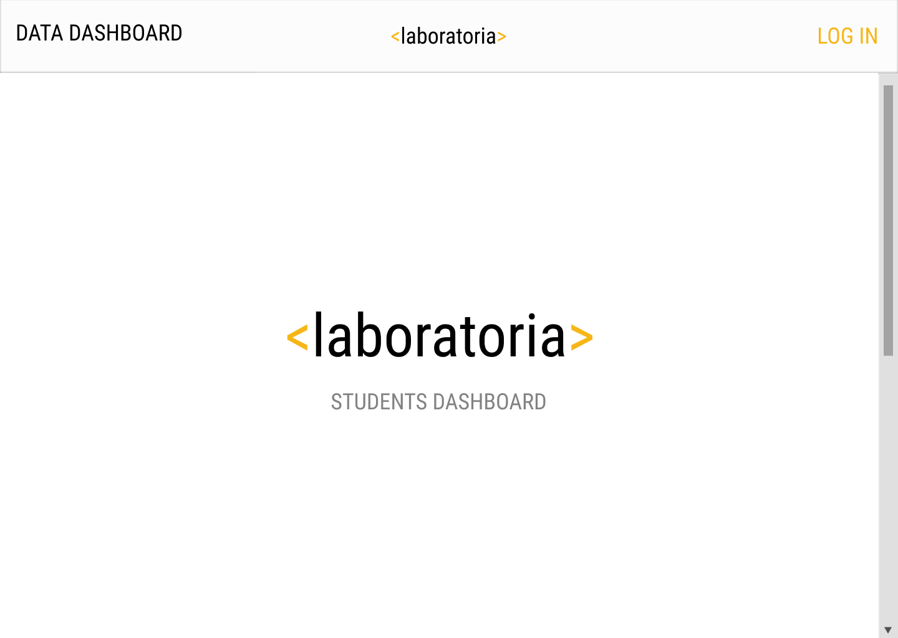

### Sketch en Marvelapp
Se importan los sketches creados con figma, para dotarlos de una interacción simulada. Que permite visualizar de forma más acercada a la realidad cómo funcionará la página. Esto nos permitiría realizar pruebas con el usuario para detectar aciertos y áreas de oportunidad dentro de la propuesta. Para este ejercicio se realizó un proyecto  “data-dash” con 15 imágenes, visible en el vínculo: **https://marvelapp.com/78c5h2a **

**Algunas imágenes del proceso:**

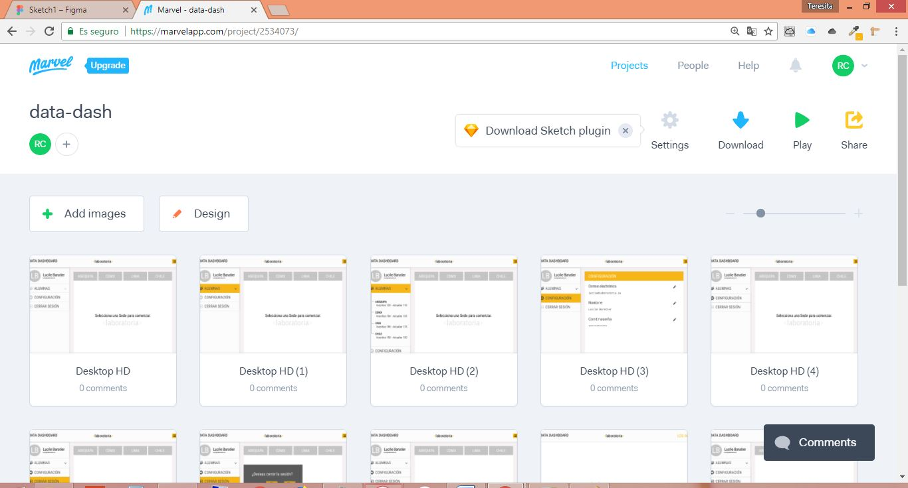

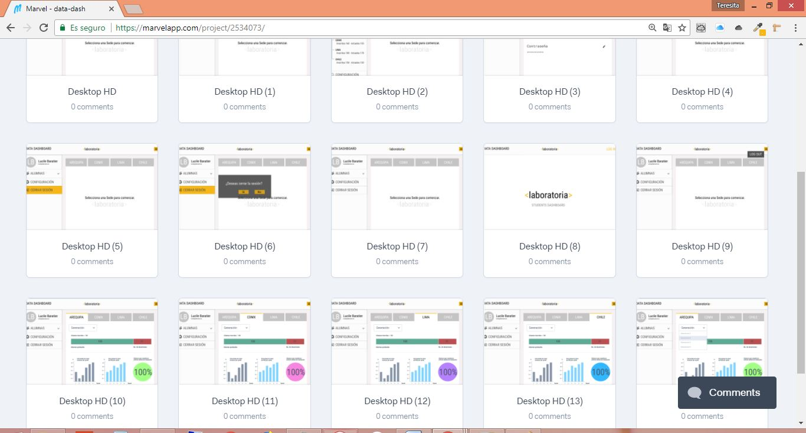

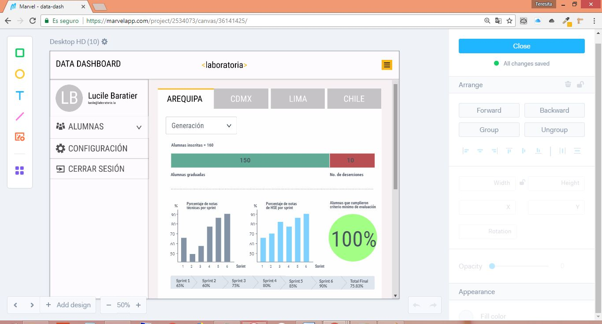
